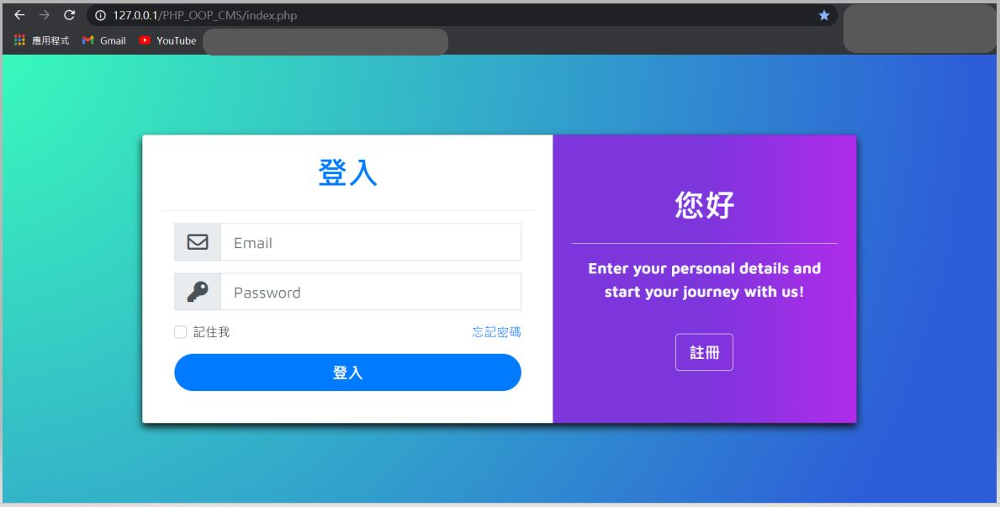
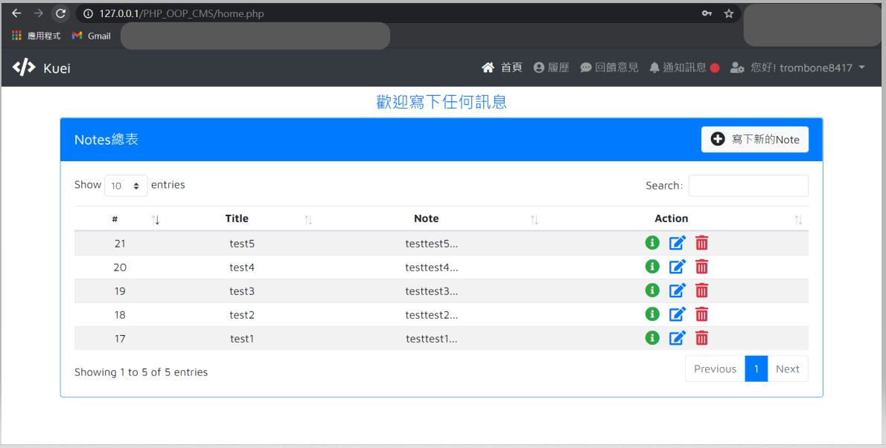
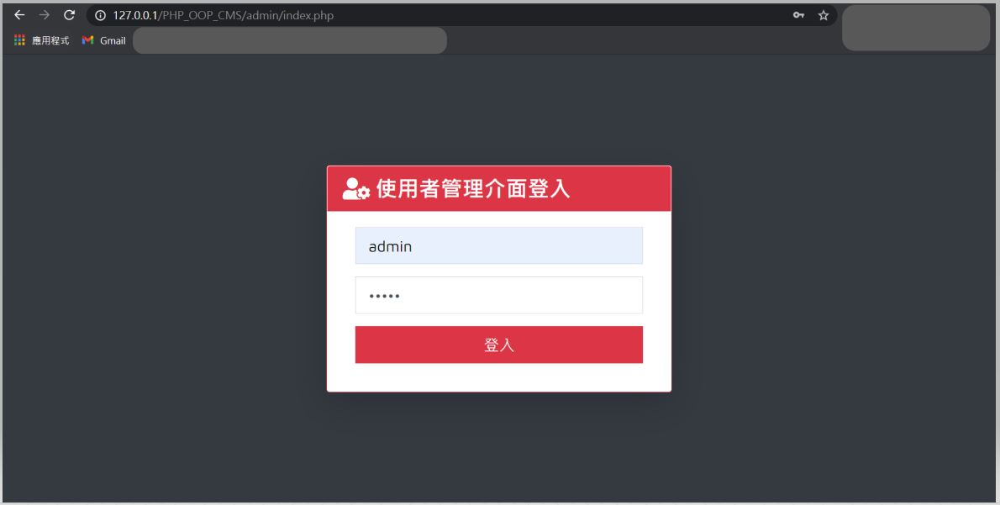
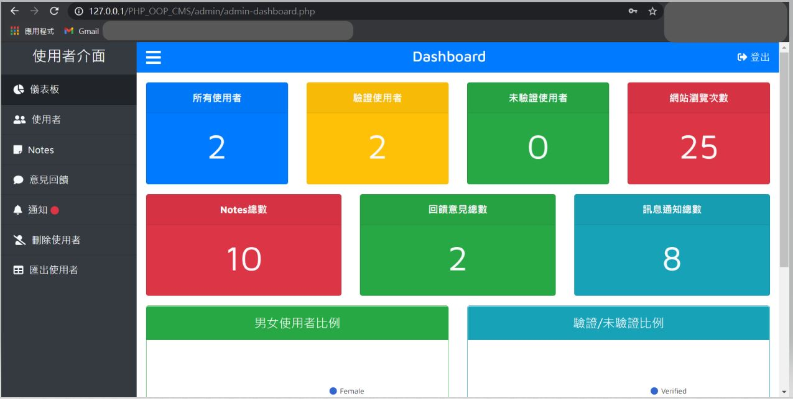
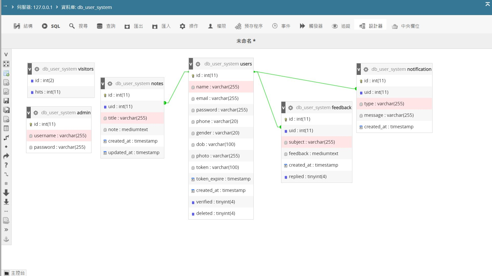

# PHP_OOP_CMS
該篇文章參考至youtube線上教學進行練習，
為「使用者管理系統」，
使用的語言為PHP、ajax、css、bootstrap、html、sweetalert，
撰寫的方式為物件導向

## 工具
Visual studio code
PHPCS
Xdebug
F12 console

##結果

資料來源：
YOUTUBE平台
名稱：User Management System With Admin Panel | Working On User Registration
作者：DCodeMania